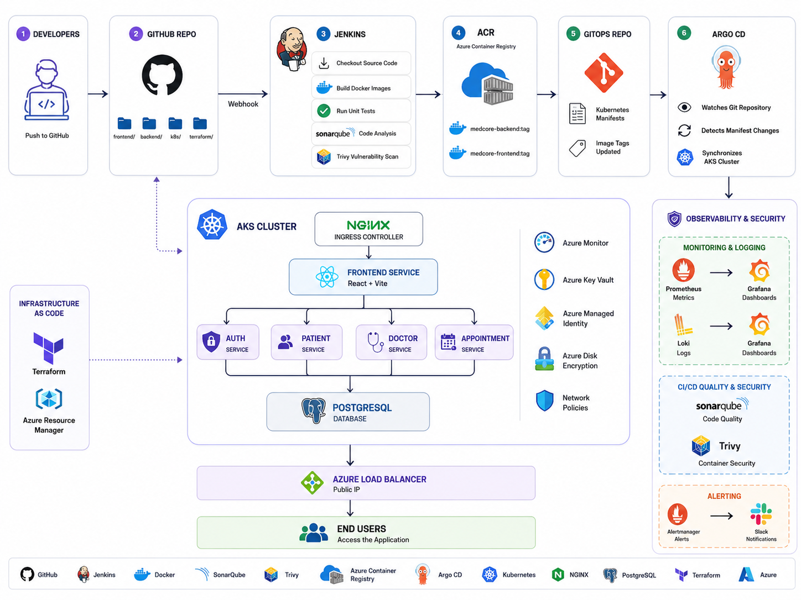

# MedCore Health System

A comprehensive hospital management system with a React frontend and a Node.js/Express backend.

## Architecture

## DevOps Architecture

<p align="center">
  
</p>


- **Frontend:** React + Vite, Tailwind CSS
- **Backend:** Node.js + Express
- **Database:** PostgreSQL
- **ORM:** Prisma
- **Auth:** JWT bearer tokens with bcrypt password hashing
- **Validation:** Zod
- **Security:** Helmet, CORS, rate limiting

## Microservice Split

The backend can now run as either the original monolith or as a route-scoped service. This is a safe first microservice step for learning Kubernetes and DevSecOps because the current Prisma schema still has many cross-domain relations.

Set `MEDCORE_SERVICE` to choose which service the backend process exposes:

| Service | Owns routes |
|---|---|
| `monolith` | All API routes, useful for local development |
| `auth` | `/api/v1/auth` |
| `admin` | `/api/v1/users`, `/api/v1/dashboard`, `/api/v1/audit-logs`, `/api/v1/settings` |
| `patient` | `/api/v1/patients` |
| `doctor` | `/api/v1/doctors`, `/api/v1/departments`, `/api/v1/schedule-slots` |
| `appointment` | `/api/v1/appointments` |
| `clinical` | `/api/v1/medical`, `/api/v1/lab` |
| `payment` | `/api/v1/billing`, `/api/v1/stripe` |
| `operations` | `/api/v1/facility`, `/api/v1/pharmacy` |
| `communication` | `/api/v1/communication` |

Kubernetes routes traffic with AWS ALB Ingress:

```text
Internet -> AWS ALB -> Kubernetes Ingress
                         ├── frontend
                         ├── auth-service
                         ├── admin-service
                         ├── patient-service
                         ├── doctor-service
                         ├── appointment-service
                         ├── clinical-service
                         ├── payment-service
                         ├── operations-service
                         └── communication-service
```

For this learning split, all backend services use one PostgreSQL StatefulSet. A true database-per-service design is the next refactor and requires removing cross-service Prisma joins in favor of service APIs/events.

## Setup Instructions

### Backend Setup

1. Install PostgreSQL and create a database named `medcore_health`.
2. Copy the environment file:
   ```bash
   cd backend
   copy .env.example .env
   ```
3. Update `DATABASE_URL` and `JWT_SECRET` in `.env`.
4. Install dependencies:
   ```bash
   npm install
   ```
5. Create database tables:
   ```bash
   npm run prisma:migrate -- --name init
   ```
6. Seed demo data:
   ```bash
   npm run db:seed
   ```
7. Start the backend:
   ```bash
   npm run dev
   ```

Backend runs on `http://localhost:5000`

To run one backend service locally:

```bash
MEDCORE_SERVICE=auth npm run dev
```

### Frontend Setup

1. Copy the environment file:
   ```bash
   cd frontend
   copy .env.example .env
   ```
   (Make sure `VITE_API_BASE_URL=http://localhost:5000/api/v1` is set in your `.env`)
2. Install dependencies:
   ```bash
   npm install
   ```
3. Start the frontend:
   ```bash
   npm run dev
   ```

Frontend runs on `http://127.0.0.1:5173`

## Docker Images

Build the backend image once and run it with different `MEDCORE_SERVICE` values:

```bash
docker build -t medcore-backend:local ./backend
docker build -t medcore-frontend:local ./frontend
```

For AWS, push images to Amazon ECR and replace this placeholder in the Kubernetes YAML files:

```text
ACCOUNT_ID.dkr.ecr.REGION.amazonaws.com
```

## Kubernetes on AWS EKS

Kubernetes files are in `k8s/`:

```text
k8s/
  namespace.yaml
  secrets.example.yaml
  backend/configmap.yaml
  backend/services.yaml
  backend/hpa.yaml
  database/postgres.yaml
  database/migrate-job.yaml
  frontend/deployment.yaml
  ingress/alb-ingress.yaml
  security/service-accounts.yaml
  security/network-policies.yaml
  kustomization.yaml
```

Before deployment:

1. Copy `k8s/secrets.example.yaml` to your own secret file and replace placeholder values.
2. Replace the backend/frontend image placeholders with your ECR image URLs.
3. Update `CLIENT_ORIGIN` in `k8s/backend/configmap.yaml` after you know your ALB DNS name.
4. Install AWS Load Balancer Controller in your EKS cluster.
5. Install metrics-server if you want the HorizontalPodAutoscaler resources to work.
6. Use an EKS networking setup that enforces Kubernetes NetworkPolicy if you want the network policies to be active.
7. Apply namespace and secrets first, then apply the rest of `k8s/`.

Educational deployment order:

```bash
kubectl apply -f k8s/namespace.yaml
kubectl apply -f k8s/secrets.yaml
kubectl apply -k k8s
```

After Postgres is ready, run or re-run the Prisma migration job:

```bash
kubectl delete job medcore-prisma-migrate -n medcore --ignore-not-found
kubectl apply -f k8s/database/migrate-job.yaml
```

## Azure AKS with Terraform

Azure Terraform code is in `terraform/azure/`. The Azure stack now follows a GitOps-oriented flow:

```text
Terraform -> Resource Group, VNet, AKS, ACR, PostgreSQL, ingress-nginx, ArgoCD, DevSecOps VM, app bootstrap resources
ArgoCD    -> MedCore application manifests from k8s/apps/medcore-azure
ArgoCD    -> Filebeat log shipping manifests from k8s/logging/filebeat
ArgoCD    -> kube-prometheus-stack using values from k8s/monitoring/kube-prometheus-stack/values.yaml
```

What Terraform provisions:

```text
Azure Resource Group
Azure Virtual Network
Azure Kubernetes Service
Azure Container Registry
Azure Database for PostgreSQL Flexible Server
Private DNS for PostgreSQL
Single DevSecOps Azure VM for Jenkins, ELK, Prometheus, Grafana, Trivy, and SonarQube
ingress-nginx on AKS
ArgoCD on AKS
Application namespace prerequisites, secrets, config, service accounts, and GitOps bootstrap Applications
```

### 1. Prepare Terraform inputs

```bash
cd terraform/azure
copy terraform.tfvars.example terraform.tfvars
```

Set at least these values in `terraform.tfvars`:

```hcl
devsecops_admin_ssh_public_key = "ssh-rsa REPLACE_WITH_YOUR_PUBLIC_KEY"
gitops_repo_url                = "https://github.com/REPLACE_WITH_YOUR_ORG/REPLACE_WITH_YOUR_REPO.git"
gitops_repo_revision           = "main"
```

If Terraform cannot detect your Azure subscription, set `subscription_id` in `terraform.tfvars` or export `ARM_SUBSCRIPTION_ID`.

For better security, replace the default lab CIDR with your own public IP:

```hcl
devsecops_allowed_source_cidrs = ["YOUR_PUBLIC_IP/32"]
```

The single DevSecOps VM is intentionally large for a one-box learning setup:

```hcl
enable_devsecops_vm         = true
devsecops_vm_size           = "Standard_D16s_v5"
devsecops_data_disk_size_gb = 1024
```

It runs:

```text
Jenkins       -> http://<devsecops-vm-ip>:8080
SonarQube     -> http://<devsecops-vm-ip>:9000
Kibana        -> http://<devsecops-vm-ip>:5601
Prometheus    -> http://<devsecops-vm-ip>:9090
Grafana       -> http://<devsecops-vm-ip>:3000
Elasticsearch -> http://<devsecops-vm-ip>:9200
Trivy server  -> http://<devsecops-vm-ip>:4954
```

### 2. Build immutable images and push them to ACR

Do not use `latest`. Pick a versioned tag such as a git SHA or release ID:

```bash
IMAGE_TAG=2026.05.20-001
```

Initialize Terraform and create the Azure platform:

```bash
terraform init
terraform apply
```

Then get the ACR details and push both images with the immutable tag:

```bash
ACR_NAME=$(terraform output -raw acr_name)
ACR_LOGIN_SERVER=$(terraform output -raw acr_login_server)

az acr login --name "$ACR_NAME"

docker build -t "$ACR_LOGIN_SERVER/medcore-backend:$IMAGE_TAG" ../../backend
docker build -t "$ACR_LOGIN_SERVER/medcore-frontend:$IMAGE_TAG" ../../frontend

docker push "$ACR_LOGIN_SERVER/medcore-backend:$IMAGE_TAG"
docker push "$ACR_LOGIN_SERVER/medcore-frontend:$IMAGE_TAG"
```

### 3. Commit the image tag change to Git

ArgoCD reads the application manifests from Git, so update the tag in:

- `k8s/apps/medcore-azure/kustomization.yaml`

Example:

```yaml
images:
  - name: medcore-backend
    newTag: 2026.05.20-001
  - name: medcore-frontend
    newTag: 2026.05.20-001
```

Commit and push that Git change. Terraform only injects the ACR registry hostname; the version tag should live in Git.

### 4. Let ArgoCD deploy the cluster workloads

After Terraform finishes:

```bash
terraform output -raw get_credentials_command
az aks get-credentials --resource-group <resource-group> --name <aks-name>
kubectl get pods -n medcore
kubectl get applications -n argocd
```

Access ArgoCD locally:

```bash
kubectl port-forward svc/argocd-server -n argocd 8088:443
```

Then open:

```text
https://localhost:8088
```

Useful outputs:

```bash
terraform output devsecops_vm_ssh_command
terraform output jenkins_url
terraform output sonarqube_url
terraform output kibana_url
terraform output prometheus_url
terraform output grafana_url
terraform output -raw grafana_admin_password
terraform output jenkins_initial_password_command
terraform output argocd_port_forward_command
terraform output argocd_initial_admin_password_command
terraform output gitops_repo_url
terraform output aks_prometheus_internal_lb_ip
terraform output logstash_private_endpoint
```

### 5. Observability flow in this design

- **AKS logs -> ELK:** ArgoCD deploys Filebeat as a DaemonSet from `k8s/logging/filebeat`. Filebeat ships container logs to Logstash on the DevSecOps VM over port `5044`.
- **AKS metrics -> Prometheus:** ArgoCD deploys `kube-prometheus-stack` in-cluster. Its Prometheus service is exposed through an internal Azure load balancer, and the DevSecOps VM Prometheus federates those cluster metrics.
- **Grafana:** Grafana on the DevSecOps VM is pre-provisioned with the local Prometheus datasource, so the federated AKS metrics appear there automatically.

### 6. Notes

- The AWS ALB ingress manifest in `k8s/ingress/alb-ingress.yaml` is not used for Azure.
- Terraform no longer deploys the MedCore application objects directly unless you explicitly set `enable_legacy_direct_deployment = true`.
- If `gitops_repo_url` points to a private repository, add repository credentials in ArgoCD before expecting syncs to succeed.
- Terraform state contains generated database and JWT secrets, so use a secure remote backend for real environments.

For a one-day lab, destroy everything when finished:

```bash
terraform destroy
```

## Demo Accounts

All demo accounts use the password: `Password@123`

- **Admin:** `admin@medcore.test`
- **Doctor:** `doctor@medcore.test`
- **Patient:** `patient@medcore.test`
